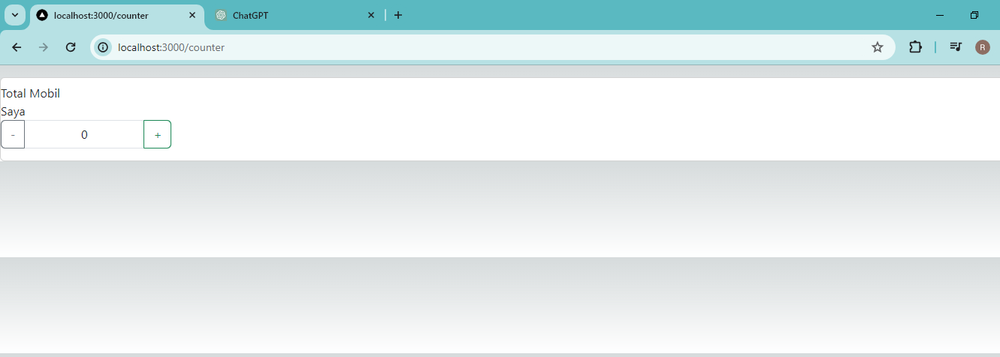
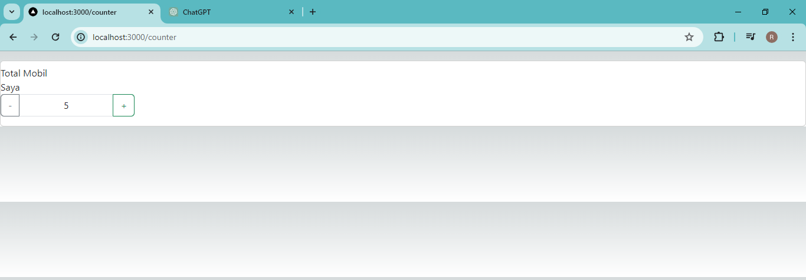
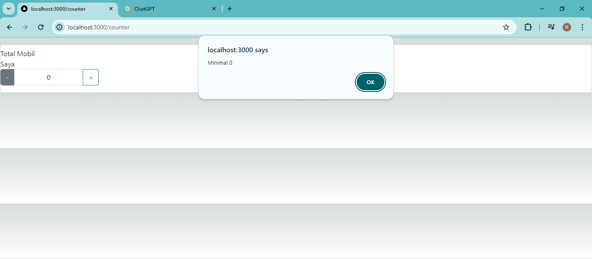

### Laporan Practicum - 5

## Practicum Report
|  | Pemrograman Berbasis Framework 2024 |
|--|--|
| NIM |  2141720166|
| Nama |  Raihan Dany Radhinnur |
| Kelas | TI - 3I |

## Practicum - 1
In this practicum 1 we try to use Redux of React JS. We install Redux and Bootstrap, after that we implement it with our code. We try to use both of Redux and Bootstrap.
Result of Practicum - 1 website
|
When we click the BUtton the pop-up window will appear.
|

## Practicum - 2
In this practicum 2 we try code Login functionality in our website. We do by make an login.tsx as login page and redux/auth.tsx and redux/store.tsx, for auth is uses as authorize login website and store what i understand have an function as rooting website.
Result of Practicum - 2 website
1. Login Button
|
2. Logout Button
|

## Practicum - 3
In this practicum 3 we try code Counter or Counting functionality in our website. We do this by make counter.tsx as counter website page and redux/counter.tsx as function of Counter alghoritmh logic action. As like previous practicum store as rooting website.
Result of Practicum - 3 website
1. General State 
|
2. State after do Add function
|
3. State after do subtraction
|

## Assignments (Practical Questions)
Answer of what i understand and this week-6 redux experiance for Practical Question.

1. What is the use of this code import { useEffect } from "react"; In the pages/_app.tsx file? explain
Answer : Overall, importing useEffect in pages/_app.tsx makes it possible to provide global setup, cleaning, or side effects that should be applied to your entire Next.js application, which makes it an effective tool for centrally managing app-wide functionality. Import { useEffect } from "react"; imports the useEffect hook from the React library. Functional components' side effects, like data fetching, external event subscription, and manual DOM interaction, are managed via the useEffect hook.

2. If in the pages/_app.tsx file we don't use useEffect (removing line 3, and lines 9-11) what will happen?
Answer : What I understand that if we remove like instruction above I think, it will not have an impact on the useEffect form because the line above is a command for using Bootstrap which does not interfere with the useEffect process, but it could be said to have failed because in practice - 6 This time we use Boostrap.

3. Why does it have to be changed to className when writing the html tag for a class in react/nextjs?
Answer : To prevent problems with JavaScript's class keyword and to write HTML tags that work with JSX, you use className instead of class in React and Next.js. Additionally, this className serves as an order to set the CSS class in the chosen className, such as div className = container.

4. Can the store in nextjs store many redux reducers?
Answer : What I understand from the experimental practice, Yes you can add many redux reducers in the store. Redux can be used with Next.js to manage the state of your application, including several reducers. Redux enables you to construct a single store that holds the state that is controlled by several reducers.

5. Explain the use of the store.js file!
Answer : In a Redux setup, the store.js file is usually used as the main configuration file where your Redux store is created and set up. Although this is the standard naming convention, you are free to rename this file if you'd like. This makes it easier for Next.Js programmers to use Redux setup as central configuration.

6. In the pages/login.tsx file, what does this code mean?
    const { isLogin } = useSelector((state) => state.auth);
Answer : The code const { isLogin } = useSelector((state) => state.auth); in the pages/login.tsx file uses the React Redux useSelector hook to extract the isLogin property from the Redux store's auth slice of state. This is each function of code :
- UseSelector : is a React Redux hook that pulls information from the state of the Redux store. It returns the chosen data from the Redux state after receiving a selector function as an input.
- (state) · state.auth: The selector function that useSelector received is this one. It returns the auth slice of the state after receiving the whole Redux state (state) as an input. This is presuming that you have a slice called auth in your Redux store structure.
- { isLogin }: This retrieves the isLogin property from the Redux state's auth slice by means of object destructuring. It allocates the state's value.To the isLogin variable, append auth.isLogin.

7. In the pages/counter.tsx file, what does this code mean?
    const {totalCounter} = useSelector((state) => state.counter);
Answer : The line const { totalCounter } = useSelector((state) => state.counter); in the pages/counter.tsx file extracts the totalCounter property from the Redux store's counter slice of state by utilizing the useSelector hook from React Redux. This is each function of each of code :
- UseSelector is a React Redux hook that pulls information from the state of the Redux store. It returns the chosen data from the Redux state after receiving a selector function as an input.
- (state) · state.counter: The selector function that useSelector received is this one. It returns the counter slice of the state after receiving the whole Redux state (state) as an argument. This is presuming that you have a slice called counter in your Redux store structure.
- { totalCounter}: This retrieves the totalCounter property from the Redux state's counter slice by means of object destructuring. It sets the totalCounter variable's value to state.counter.totalCounter.
