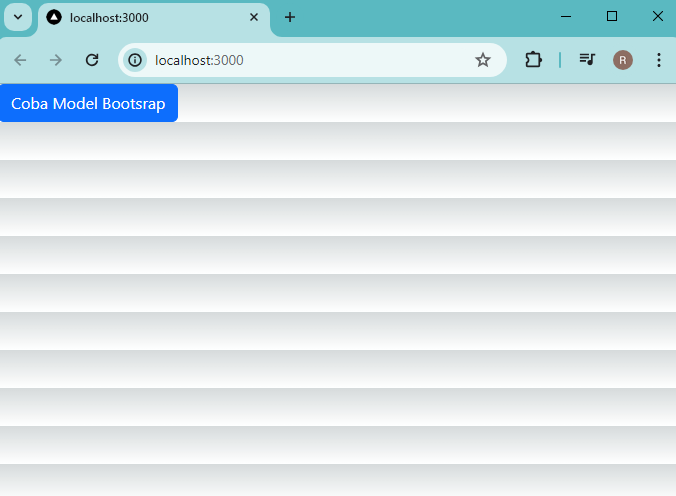
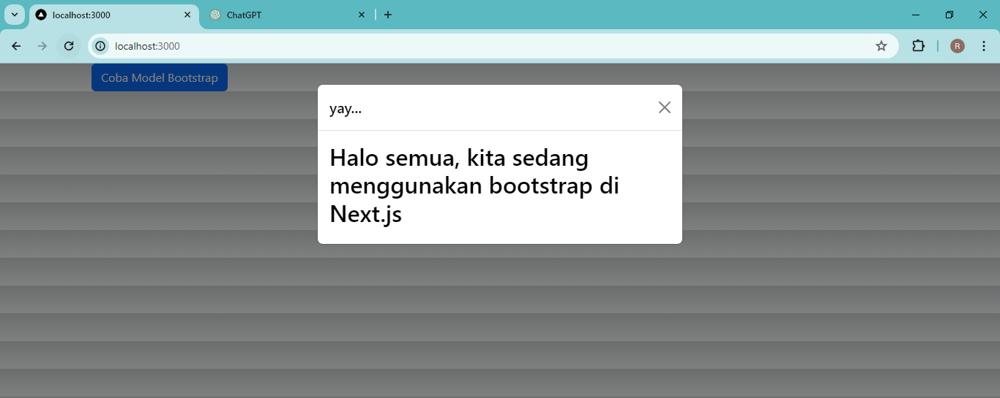
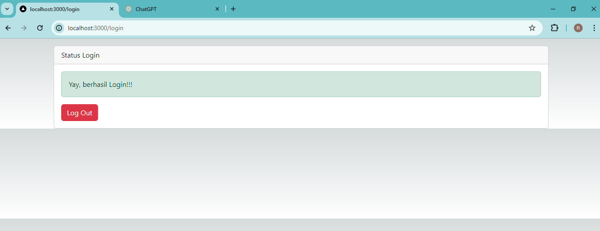

### Laporan Practicum - 5

## Practicum Report
|  | Pemrograman Berbasis Framework 2024 |
|--|--|
| NIM |  2141720166|
| Nama |  Raihan Dany Radhinnur |
| Kelas | TI - 3I |

## Practicum - 1
In this practicum 1 we try to use Redux of React JS. We install Redux and Bootstrap, after that we implement it with our code. We try to use both of Redux and Bootstrap.
|
When we click the BUtton the pop-up window will appear.
|

## Practicum - 2
In this practicum 2 we try code Login functionality in our website. We do by make an login.tsx as login page and redux/auth and redux/store, for auth is uses as authorize login website and store what i understand have an function as rooting website.
Result of Practicum - 2 website
1. Login Button
|
2. Logout Button
|

